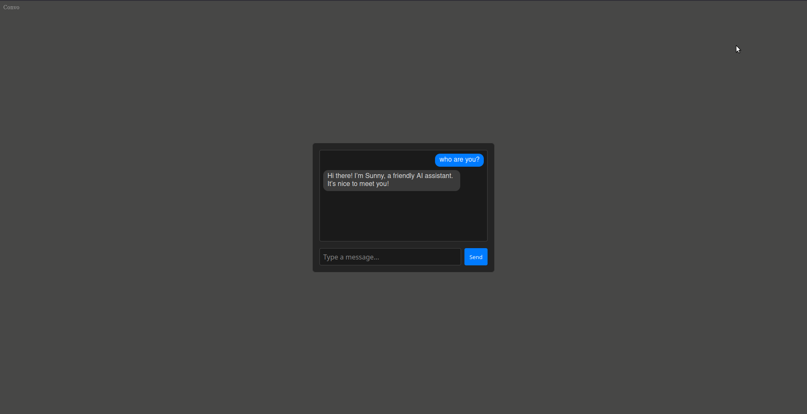

# convo

A basic AI chat component implemented using [Web Components](https://developer.mozilla.org/en-US/docs/Web/API/Web_components) with simple global state management. Connect your local/cloud LLM by setting the URL in the `api-url` attribute of the `<chat-box>` component (in index.html):

```html
<chat-box api-url="http://localhost:8720/v1/chat/completions"></chat-box>
```

