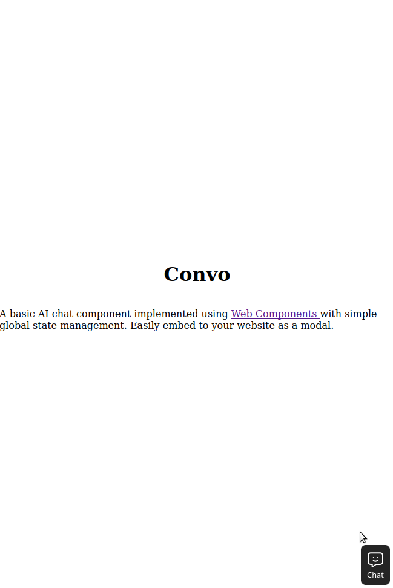

# convo

A basic AI chat component implemented using [Web Components](https://developer.mozilla.org/en-US/docs/Web/API/Web_components) with simple global state management. 

Easily embed to your website as a modal:

1. Download the `.js` files that are in the `js` directory (`chat-box.js`, `chat-box-toggle.js`, `store.js`).

2. Add the `chat-box.js` and `chat-box-toggle.js` to your webpage:

```html
<script type="module" src="js/chat-box.js"></script>
<script type="module" src="js/chat-box-toggle.js"></script>
```

3. Add the components to the body (i.e. `<chat-box>` and `<chat-box-toggle>`). Connect your local/cloud LLM by setting the URL (must be OpenAI-compatible API endpoint) in the `api-url` attribute of the `<chat-box>` component:

```html
<body>
    <chat-box
        id="convo-chat-box"
        api-url="http://localhost:8720/v1/chat/completions"
        hidden
    ></chat-box>

    <chat-box-toggle controls="convo-chat-box"></chat-box-toggle>
</body>
```

<div style="display:flex; gap:0.5rem;">


</div>